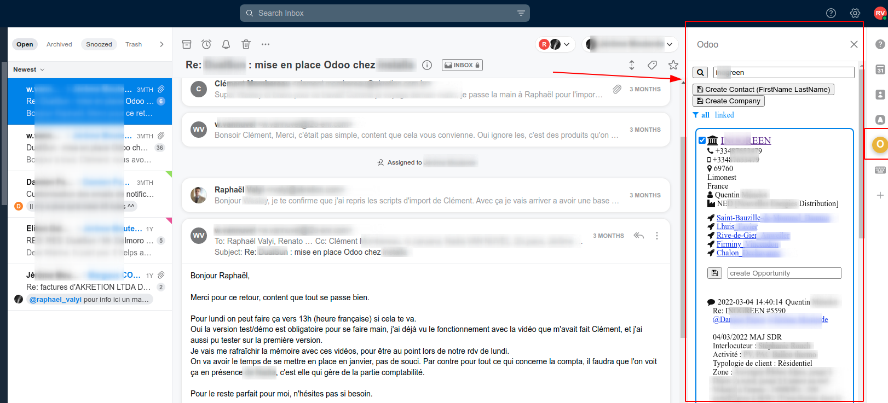

Introduction
~~~~~~~~~~~~

It's inspired from `the FrontApp demo plugin <https://github.com/frontapp/front-plugin-demo>`_
but it's developped using Odoo `OWL framework <https://github.com/odoo/owl>`_ . This plugin is resonably generic
but in fact it was done for an Akretion customer for which a few things are overriden in an extra module.

This generic module is rather simple. Features include:

 * searching (by email) for Odoo contacts related to the selected FrontApp conversation
 * enabling to explicitely link an Odoo contact to a given FrontApp conversation
 * showing key Odoo contact fields in the FrontApp plugin sidebar with links to Odoo contacts
 * listing the contact Odoo CRM opportunities
 * listing the last Odoo contact chatter notes
 * inside Odoo you have links back to the linked FrontApp conversations

The authentication is simple: you need to be logged in your Odoo in your browser to be able to use the FrontApp Odoo plugin. The Odoo session
cookie is in fact reused in the plugin iframe that is itself hosted on your Odoo server.

Testing it
~~~~~~~~~~

You can test it easily with an Odoo database with demo data and point your browser to `http://localhost:8069/frontapp-plugin`. The linked demo contacts are not linked to any
specific FrontApp conversation but you can have an idea how it works. This way of testing is handy for developping or extending the plugin.

If instead you want to test it with FrontApp you need a **developper FrontApp account**. You need to host your Odoo on a public **HTTPS** URL.
**You should also have your HTTPS proxy properly configured to allow sharing the Odoo session cookie inside the FrontApp plugin iframe.**
On Ngnix this is typically achieved using this header `proxy_cookie_path / "/; secure; HttpOnly; SameSite=None";`
Now create a new plugin in your FrontApp developper panel with the HTPPS server and the `/frontapp-plugin` path.
You should now be able to activate the Odoo plugin on the right side panel in FrontApp.
Finally browse some FrontApp conversation and see what happen in the Odoo side panel. Contacts will be searched by
their email, if no email is matched you can still search for a contact by name or email and linked it with the selected conversation.

Caveats
~~~~~~~

* The plugin has been made for Odoo 14 which doesn't play very well with Javascript ES6 modules (it will be better on more recent Odoo versions). And the FrontApp plugin SDK is now an ES6 npm package. So what I did was packaging the FrontApp SDK using a `package.json npm file <https://github.com/akretion/odoo-frontapp/blob/14.0/frontapp_plugin/static/package.json>`_ to be build with npm using `this webpack.config.js file <https://github.com/akretion/odoo-frontapp/blob/14.0/frontapp_plugin/static/webpack.config.js>`_. And finally `this file makes the bridge <https://github.com/akretion/odoo-frontapp/blob/14.0/frontapp_plugin/static/src/js/frontapp_es6_bridge.js>`_ with the non ES6 Odoo world.
* I selected OWL because I thought it was more useful for my daily usage than learning VueJS or ReactJS and also because I thought going for VueJS would may be make my work more complex to call the Odoo RPC layer, handle the login cookie etc... That being said the Odoo JSONRPC JS client layer depends on a hell of Odoo JS files in Odoo 14. So I created a `lighter jsonrpc.js file <https://github.com/akretion/odoo-frontapp/blob/14.0/frontapp_plugin/static/src/js/jsonrpc.js>`_ that depends on onbly on web.Bus instead of web.core.
* Contact me if you want to migrate the module to another Odoo version or need different features.

